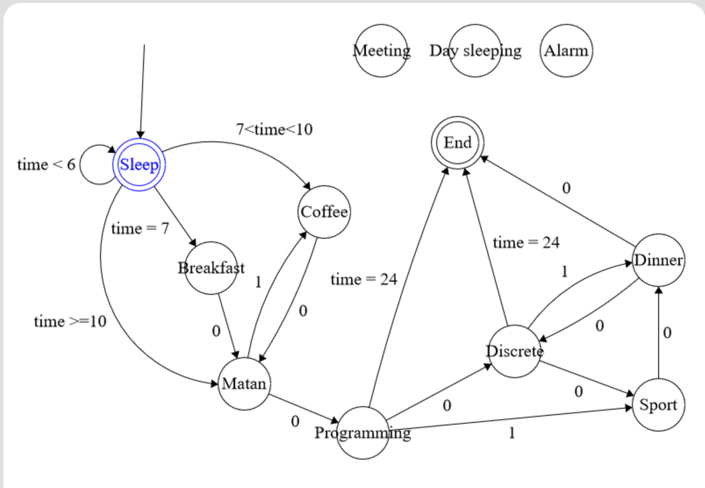

# Automata
There is an implementation of automata "Day in Life"\
There are 9 simple states, which can be reache if only it's earlier than 24:00:
* Sleep
* Breakfast
* Coffee
* Matan (Math analysis)
* Programming
* Discrete
* Sport
* Dinner
* End (at 24:00)

And 3 random states, if random value is under needed conditions:
* Air alarm (7 | random value)
* Day Sleeping (8 | random value)
* Forgotten Meeting (9 | random value)

